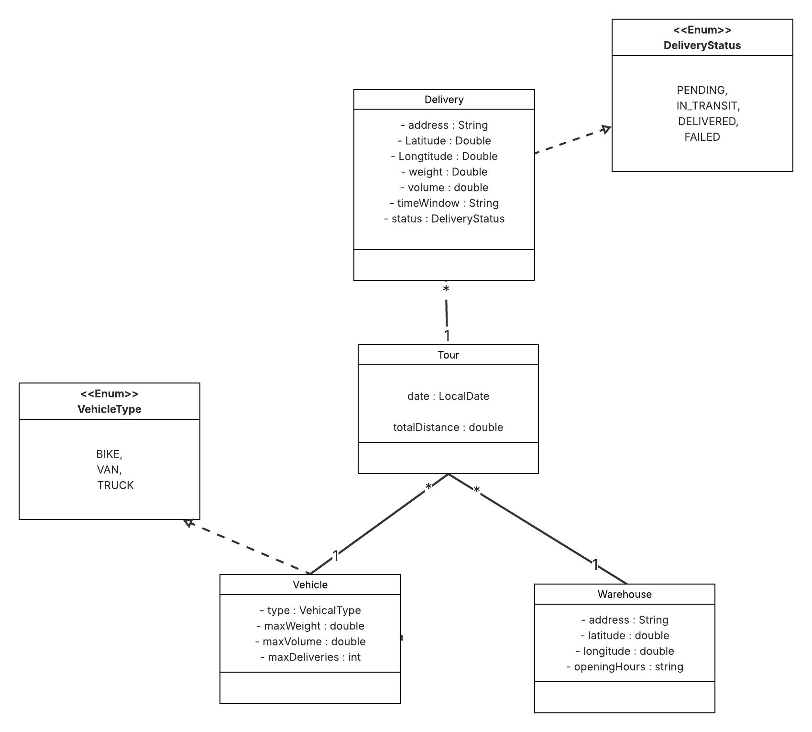
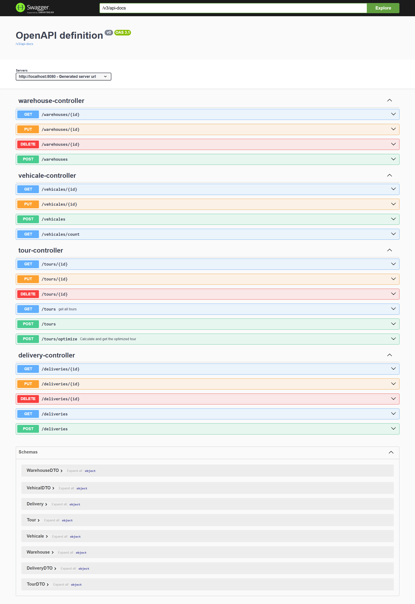

# Wasalliya

Wasalliya is a Spring Boot application designed for vehicle route optimization for deliveries. It provides a RESTful API to manage deliveries, warehouses, vehicles, and to calculate optimized delivery tours.

## Features

*   **Route Optimization:** Calculates optimized delivery routes using different algorithms.
    *   Clarke and Wright savings algorithm
    *   Nearest Neighbour algorithm
*   **RESTful API:** Provides endpoints for managing:
    *   Deliveries
    *   Tours
    *   Vehicles
    *   Warehouses
*   **API Documentation:** Integrated with Springdoc OpenAPI for easy API exploration and testing.

## Technologies Used

*   **Java 17**
*   **Spring Boot:**
    *   Spring Web
    *   Spring Data JPA
    *   Spring Boot DevTools
    *   Spring Boot Starter Validation
*   **H2 Database:** In-memory database for development and testing.
*   **Maven:** Dependency management and build tool.
*   **Lombok:** Reduces boilerplate code.
*   **Springdoc OpenAPI:** For generating API documentation.

## Getting Started

### Prerequisites

*   JDK 17 or later
*   Maven 3.2+

### Installation & Running

1.  **Clone the repository:**
    ```bash
    git clone https://github.com/your-username/wasalliya.git
    cd wasalliya
    ```

2.  **Build the project:**
    ```bash
    ./mvnw clean install
    ```

3.  **Run the application:**
    ```bash
    ./mvnw spring-boot:run
    ```
    The application will start on `http://localhost:8080`.

## API Endpoints

The API is documented using OpenAPI. Once the application is running, you can access the Swagger UI at:

[`http://localhost:8080/swagger-ui.html`](http://localhost:8080/swagger-ui.html)

This interface provides detailed information about all the available endpoints and allows you to interact with the API directly from your browser.

**Main resources include:**

*   `/deliveries`
*   `/tours`
*   `/vehicles`
*   `/warehouses`
---
## Class Diagram


---

## Swagger Endpoints




---
## License

This project is licensed under the MIT License - see the `LICENSE` file for details.
